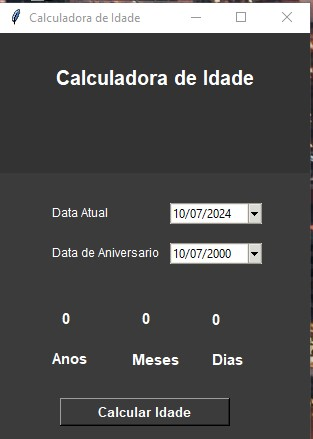

# Calculadora de Idade

Este projeto é uma **Calculadora de Idade** desenvolvida em Python utilizando a biblioteca Tkinter. A aplicação permite que os usuários insiram a data do seu aniversário e, em seguida, calcula automaticamente a idade em anos, meses e dias a partir da data atual.

## Funcionalidades

- **Interface Gráfica User-Friendly:** Desenvolvida com Tkinter, a interface é simples e direta, facilitando a interação do usuário.
- **Cálculo Automático:** A aplicação captura a data atual e calcula a diferença entre a data de nascimento e a data atual, apresentando a idade em anos, meses e dias.
- **Validação de Data:** O usuário deve inserir uma data válida para o correto funcionamento da calculadora.

## Pré-requisitos

Antes de executar o programa, certifique-se de que você tem o Python instalado em sua máquina. Você pode baixar o Python em [python.org](https://www.python.org/downloads/).

Além disso, não há dependências externas específicas, pois o Tkinter é uma biblioteca padrão que vem incluída com a maioria das distribuições do Python.

## Como Executar

1. Clone o repositório:
   ```bash
   git clone https://github.com/seuusuario/seurepositorio.git




